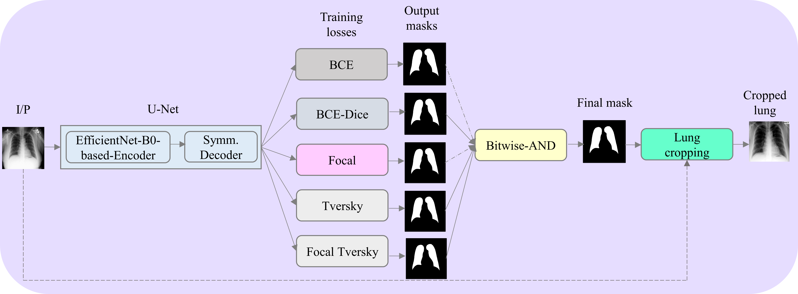
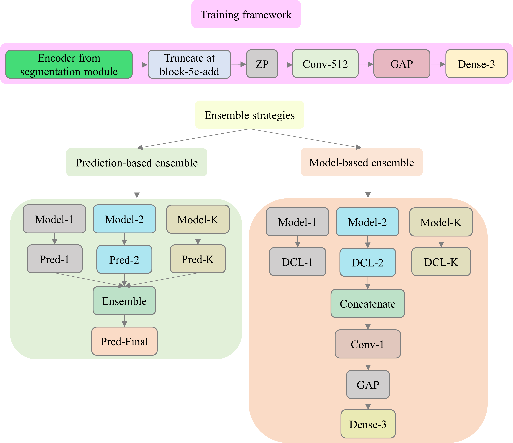

# Multiloss_ensemble_learning
The code proposes various novel loss functions to train the DL models and construct their ensembles to improve performance in a multiclass classification task using chest radiographs

#### Kindly cite our study when using these codes for your research:

### Rajaraman S, Zamzmi G, Antani SK (2021) Novel loss functions for ensemble-based medical image classification. PLoS ONE 16(12): e0261307. https://doi.org/10.1371/journal.pone.0261307

## Requirements:
Tenforflow == 2.4.0

Keras == 2.4.0

#other supporting libraries as mentioned in the code

# Aim and objective of the study:

Medical images commonly exhibit multiple abnormalities. Predicting them requires multi-class classifiers whose training and desired reliable performance can be affected by a combination of factors, such as, dataset size, data source, distribution, and the loss function used to train the deep neural networks. Currently, the cross-entropy loss remains the de-facto loss function for training deep learning classifiers. This loss function, however, asserts equal learning from all classes, leading to a bias toward the majority class. Although the choice of the loss function impacts model performance, to the best of our knowledge, we observed that no literature exists that performs a comprehensive analysis, comparison, and selection of an appropriate loss function toward the classification task under study. In this work, we benchmark various state-of-the-art loss functions that are suitable for multi-class classification, critically analyze model performance, and propose improved loss functions. We select a pediatric chest X-ray (CXR) dataset that includes images with no abnormality (normal), and those exhibiting manifestations consistent with bacterial and viral pneumonia. We construct prediction-level and model-level ensembles, respectively, to improve classification performance. Our results show that compared to the individual models and the state-of-the-art literature, the weighted averaging of the predictions for top-3 and top-5 model-level ensembles delivered significantly superior classification performance (p < 0.05) in terms of MCC (0.9068, 95% confidence interval (0.8839, 0.9297)) metric. Finally, we performed localization studies to interpret model behaviors to visualize and confirm that the individual models and ensembles learned meaningful features and highlighted disease manifestations.  

### Segmentation module:

The figure below shows the segmentation module proposed in this study. An EfficientNet-B0-based U-Net model is used to generate lung masks. The predicted lung masks for the pediatric CXR collection published by Kermany et al. is overlaid on the original CXRs, the ling boundaries are delineated and cropped. The cropped lungs are further used for classification studies.

### Classification module:

The classification module proposed in this study is shown below.

### Localization studies:

We further performed localization studies using Grad_CAM to localize the disease ROIs learned by the indiviudal models that are trained with various loss functions and the model-level ensembles. The models precisely learned the ROIs as shown below.

The repository includes the complete code to follow the steps discussed in this study. 
